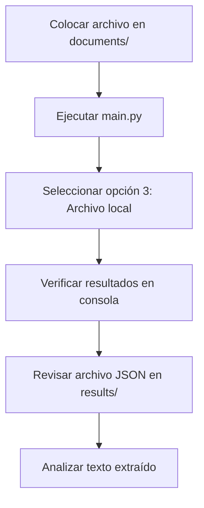
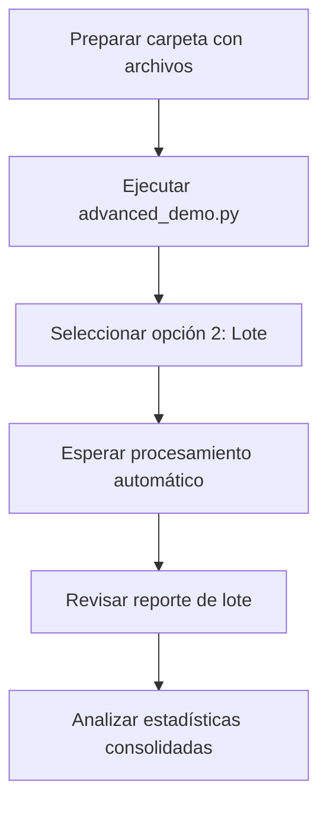
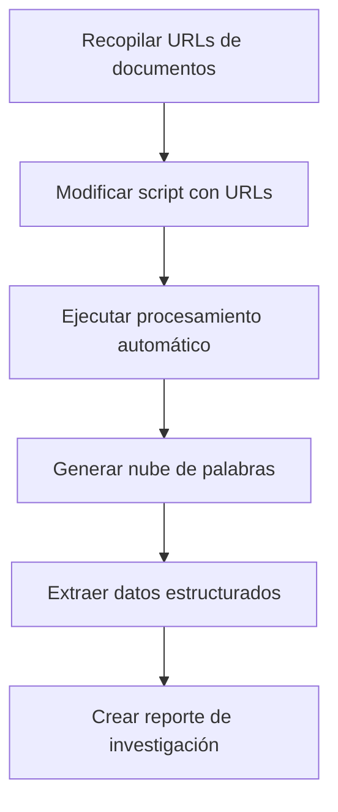

# 🔍 Mistral OCR Explorer

Un proyecto completo en Python para explorar y probar todas las capacidades de **Mistral Document AI** con OCR avanzado. Diseñado específicamente para desarrolladores que quieren aprender y experimentar con las funcionalidades de OCR de Mistral de manera didáctica y práctica.

## 🌟 Características Principales

### 📄 Procesamiento de Documentos
- ✅ **Múltiples formatos**: PDF, DOCX, PPTX, imágenes (PNG, JPEG, AVIF)
- ✅ **Tres métodos de procesamiento**: 
  - Local (codificación Base64)
  - Upload a servidores de Mistral
  - Procesamiento directo desde URLs
- ✅ **Preservación de estructura**: Mantiene headers, párrafos, listas y tablas
- ✅ **Salida en Markdown**: Formato fácil de leer y procesar

### 🧠 Análisis Avanzado
- ✅ **Extracción de datos estructurados**: Emails, teléfonos, URLs, fechas, números
- ✅ **Análisis de contenido**: Conteo de caracteres, palabras, líneas
- ✅ **Detección de elementos**: Imágenes, headers, estructura del documento
- ✅ **Nubes de palabras**: Visualización automática del contenido más relevante

### ⚡ Procesamiento Masivo
- ✅ **Procesamiento en lote**: Procesa carpetas completas automáticamente
- ✅ **Benchmarking**: Mide velocidad y rendimiento del OCR
- ✅ **Comparación de métodos**: Evalúa diferentes enfoques para el mismo archivo
- ✅ **Reportes automáticos**: Genera informes detallados en Markdown

### 🎯 Interfaz de Usuario
- ✅ **Menús interactivos**: Fácil navegación por todas las funciones
- ✅ **Modo básico y avanzado**: Desde funciones simples hasta análisis complejos
- ✅ **Diagnóstico integrado**: Herramientas para resolver problemas
- ✅ **Documentación contextual**: Ayuda integrada en cada función

## 🚀 Instalación Paso a Paso

### 1. Requisitos Previos
- **Python 3.8+** (recomendado Python 3.9 o superior)
- **PyCharm** (o cualquier IDE de Python)
- **Cuenta en Mistral AI** con API key válida
- **Conexión a internet** para el API de Mistral

### 2. Configuración del Proyecto

#### 2.1 Crear el Proyecto
```bash
# Crear carpeta del proyecto
mkdir mistral_ocr_explorer
cd mistral_ocr_explorer

# Crear entorno virtual
python -m venv venv

# Activar entorno virtual
# En Windows:
venv\Scripts\activate
# En macOS/Linux:
source venv/bin/activate
```

#### 2.2 Instalar Dependencias

**Dependencias básicas (obligatorias):**
```bash
pip install mistralai python-dotenv PyPDF2 python-docx docx2txt Pillow
```

**Dependencias avanzadas (opcionales para funciones de visualización):**
```bash
pip install matplotlib seaborn wordcloud pandas numpy requests tqdm
```

**O instalar todo de una vez:**
```bash
pip install -r requirements.txt
```

#### 2.3 Configurar API Key

1. **Obtener API Key:**
   - Ve a [console.mistral.ai](https://console.mistral.ai/)
   - Regístrate o inicia sesión
   - Navega a "API Keys"
   - Crea una nueva API key
   - Copia la key (¡guárdala en lugar seguro!)

2. **Crear archivo .env:**
   ```bash
   # Crear archivo .env en la raíz del proyecto
   echo "MISTRAL_API_KEY=tu_api_key_aqui" > .env
   ```

   O crear manualmente con contenido:
   ```env
   MISTRAL_API_KEY=paste_your_actual_api_key_here
   ```

### 3. Estructura del Proyecto

Crea esta estructura de carpetas exacta:

```
mistral_ocr_explorer/
│
├── .env                           # ⚠️ Tu API key (NO subir a Git)
├── .gitignore                     # Ignorar .env y venv
├── main.py                        # 🎯 Demo básico interactivo
├── advanced_demo.py               # 🚀 Demo avanzado completo
├── requirements.txt               # 📦 Lista de dependencias
├── README.md                      # 📖 Esta documentación
│
├── src/                           # 🔧 Código fuente
│   ├── __init__.py               # (archivo vacío)
│   ├── ocr_processor.py          # 🧠 Clase principal de OCR
│   └── utils.py                  # 🛠️ Utilidades y análisis avanzado
│
├── documents/                     # 📁 Tus archivos a procesar
│   ├── pdf/                      # Archivos PDF
│   ├── word/                     # Archivos DOCX
│   ├── images/                   # Imágenes PNG/JPEG/AVIF
│   └── samples/                  # Archivos de muestra (descargados automáticamente)
│
└── results/                       # 📊 Resultados y reportes
    ├── *.json                    # Respuestas completas del OCR
    ├── *.png                     # Nubes de palabras generadas
    └── *.md                      # Reportes de análisis
```

#### 3.1 Crear Carpetas
```bash
# Crear estructura de carpetas
mkdir -p src documents/{pdf,word,images,samples} results

# Crear archivos __init__.py
touch src/__init__.py
```

#### 3.2 Crear .gitignore
```gitignore
# Entorno virtual
venv/
.venv/

# Variables de entorno
.env

# Archivos Python
__pycache__/
*.pyc
*.pyo
*.pyd
.Python

# Resultados temporales
results/*.json
results/*.png

# IDE
.idea/
.vscode/
*.swp
*.swo

# Sistema
.DS_Store
Thumbs.db
```

## 📖 Uso del Sistema

### 🎯 Demo Básico (Principiantes)

El demo básico es perfecto para empezar y entender las funcionalidades principales:

```bash
python main.py
```

**Funciones incluidas:**
1. **📄 Procesar PDF desde URL**: Descarga y procesa un paper científico de arXiv
2. **🖼️ Procesar imagen desde URL**: Analiza una imagen de recibo
3. **📁 Procesar archivo local**: Procesa archivos de tus carpetas documents/
4. **☁️ Subir y procesar**: Sube archivos a Mistral y los procesa
5. **🔍 Ver archivos disponibles**: Lista todos los archivos en tus carpetas
6. **📊 Información del API**: Muestra límites y capacidades

**Ejemplo de sesión básica:**
```
============================================================
🎯 MENÚ INTERACTIVO - MISTRAL OCR
============================================================
1. 📄 Procesar PDF desde URL (arXiv paper)
2. 🖼️ Procesar imagen desde URL (recibo)
3. 📁 Procesar archivo local
4. ☁️ Subir y procesar archivo
5. 🔍 Ver archivos disponibles
6. 📊 Mostrar información del API
0. ❌ Salir
------------------------------------------------------------
Selecciona una opción (0-6): 1

🔄 Procesando documento desde URL: https://arxiv.org/pdf/2201.04234
✅ Documento procesado exitosamente desde URL
💾 Resultados guardados en: results\arxiv_paper_ocr.json

📝 Primeros 500 caracteres del texto extraído:
--------------------------------------------------
# Chain-of-Thought Prompting Elicits Reasoning in Large Language Models

## Abstract

We explore how generating a chain of thought—a series of intermediate reasoning steps—significantly improves the ability of large language models to perform complex reasoning. In particular, we show that by prompting the model to think step by step, even simple prompting methods can achieve substantial improvements on a range of arithmetic, commonsense, and symbolic reasoning tasks...

📊 Análisis del documento:
  • total_characters: 45,678
  • total_words: 8,234
  • total_lines: 892
  • has_images: True
  • document_type: unknown
  • processing_time: unknown
```

### 🚀 Demo Avanzado (Usuarios Experimentados)

Para funcionalidades completas y análisis profundo:

```bash
python advanced_demo.py
```

**Funciones avanzadas incluidas:**

#### 📊 Análisis y Procesamiento
1. **🔬 Análisis avanzado de texto**
   - Extracción de datos estructurados (emails, teléfonos, URLs, fechas)
   - Generación de nubes de palabras
   - Análisis estadístico detallado

2. **📦 Procesamiento en lote**
   - Procesa carpetas completas automáticamente
   - Genera estadísticas consolidadas
   - Crea reportes de procesamiento masivo

3. **⚖️ Comparación de métodos**
   - Compara método local vs upload
   - Analiza velocidad y precisión
   - Recomienda el mejor método para cada tipo de archivo

4. **⏱️ Benchmark de rendimiento**
   - Mide velocidad de procesamiento
   - Calcula caracteres y palabras por segundo
   - Identifica cuellos de botella

#### 🛠️ Utilidades
5. **📝 Crear archivos de muestra**
   - Descarga automáticamente PDFs y imágenes de ejemplo
   - Configura el entorno para pruebas

6. **🧹 Limpiar carpeta de resultados**
   - Gestión de archivos de resultados
   - Limpieza selectiva con confirmación

7. **📋 Generar reporte completo**
   - Reporte detallado de todos los procesamientos
   - Estadísticas consolidadas
   - Análisis de rendimiento

8. **🔍 Explorar archivo específico**
   - Análisis individual detallado
   - Diagnóstico de problemas
   - Vista completa de metadatos

## 💻 Ejemplos de Código

### Ejemplo 1: Procesamiento Básico

```python
from src.ocr_processor import MistralOCRProcessor

# Inicializar el procesador
processor = MistralOCRProcessor()

# Procesar un PDF desde URL
response = processor.process_document_from_url(
    "https://arxiv.org/pdf/2201.04234", 
    "document_url"
)

if response:
    # Extraer el texto
    text = processor.extract_text_content(response)
    print(f"📝 Texto extraído: {len(text)} caracteres")
    
    # Analizar estructura
    analysis = processor.analyze_document_structure(response)
    print(f"📊 Palabras: {analysis['total_words']}")
    print(f"📊 Líneas: {analysis['total_lines']}")
    
    # Guardar resultados
    result_file = processor.save_results(response, "mi_paper.json")
    print(f"💾 Guardado en: {result_file}")
```

### Ejemplo 2: Procesamiento de Archivo Local

```python
from src.ocr_processor import MistralOCRProcessor

processor = MistralOCRProcessor()

# Procesar archivo local
file_path = "documents/pdf/mi_documento.pdf"
response = processor.process_local_file(file_path)

if response:
    # Extraer y mostrar texto
    text = processor.extract_text_content(response)
    print(f"📄 Documento procesado: {len(text.split())} palabras")
    
    # Mostrar muestra del texto
    print(f"📝 Primeros 200 caracteres:")
    print(text[:200] + "..." if len(text) > 200 else text)
else:
    print("❌ Error al procesar el archivo")
```

### Ejemplo 3: Análisis Avanzado con Datos Estructurados

```python
from src.ocr_processor import MistralOCRProcessor
from src.utils import extract_structured_data, create_word_cloud

processor = MistralOCRProcessor()

# Procesar una imagen con texto (ej: factura)
response = processor.process_local_file("documents/images/factura.png")

if response:
    text = processor.extract_text_content(response)
    
    # Extraer datos estructurados
    structured_data = extract_structured_data(text)
    
    print("🔍 Datos encontrados:")
    print(f"  📧 Emails: {len(structured_data['emails'])}")
    print(f"  📞 Teléfonos: {len(structured_data['phones'])}")
    print(f"  📅 Fechas: {len(structured_data['dates'])}")
    print(f"  💰 Números: {len(structured_data['numbers'])}")
    
    # Mostrar algunos ejemplos
    if structured_data['emails']:
        print(f"  📧 Email encontrado: {structured_data['emails'][0]}")
    
    # Crear nube de palabras
    create_word_cloud(text, "results/factura_wordcloud.png")
```

### Ejemplo 4: Procesamiento en Lote

```python
from src.utils import batch_process_folder, generate_batch_report

# Procesar toda una carpeta
batch_results = batch_process_folder("documents/pdf", processor)

print(f"📦 Resultados del lote:")
print(f"  ✅ Procesados: {batch_results['processed_files']}")
print(f"  ❌ Errores: {batch_results['failed_files']}")
print(f"  📊 Total caracteres: {batch_results['summary']['total_characters']:,}")
print(f"  📝 Total palabras: {batch_results['summary']['total_words']:,}")

# Generar reporte del lote
report_path = generate_batch_report(batch_results)
print(f"📋 Reporte guardado en: {report_path}")
```

### Ejemplo 5: Benchmark de Rendimiento

```python
from src.utils import performance_benchmark

# Lista de archivos para probar
test_files = [
    "documents/pdf/documento1.pdf",
    "documents/pdf/documento2.pdf",
    "documents/images/imagen1.png"
]

# Ejecutar benchmark
benchmark_results = performance_benchmark(processor, test_files)

print(f"⏱️ Resultados del Benchmark:")
print(f"  🕐 Tiempo total: {benchmark_results['total_time']:.2f} segundos")
print(f"  📊 Promedio: {benchmark_results['average_time']:.2f} seg/archivo")
print(f"  ⚡ Velocidad: {benchmark_results['characters_per_second']:.0f} chars/seg")
```

## 🔧 Configuración Avanzada

### Variables de Entorno

Además de la API key, puedes configurar otras opciones en el archivo `.env`:

```env
# Obligatorio
MISTRAL_API_KEY=tu_api_key_de_mistral

# Opcional - Configuraciones avanzadas
MISTRAL_API_BASE_URL=https://api.mistral.ai/v1
MISTRAL_TIMEOUT=120
DEBUG_MODE=false
MAX_FILE_SIZE_MB=50
DEFAULT_INCLUDE_IMAGES=true
```

### Personalización de Análisis

Puedes extender las funciones de análisis creando nuevas funciones en `utils.py`:

```python
def extract_financial_data(text: str) -> Dict[str, List[str]]:
    """Extrae datos financieros específicos del texto"""
    import re
    
    patterns = {
        "amounts": r'\$\d+(?:,\d{3})*(?:\.\d{2})?',
        "percentages": r'\d+(?:\.\d+)?%',
        "currencies": r'(USD|EUR|GBP|MXN)\s*\d+',
        "account_numbers": r'\b\d{4}[-\s]?\d{4}[-\s]?\d{4}[-\s]?\d{4}\b'
    }
    
    results = {}
    for key, pattern in patterns.items():
        results[key] = re.findall(pattern, text, re.IGNORECASE)
    
    return results

def analyze_document_sentiment(text: str) -> Dict[str, Any]:
    """Análisis básico de sentimiento del documento"""
    positive_words = ['excelente', 'bueno', 'positivo', 'éxito', 'beneficio']
    negative_words = ['malo', 'error', 'problema', 'falla', 'negativo']
    
    text_lower = text.lower()
    positive_count = sum(text_lower.count(word) for word in positive_words)
    negative_count = sum(text_lower.count(word) for word in negative_words)
    
    return {
        "positive_indicators": positive_count,
        "negative_indicators": negative_count,
        "sentiment_score": positive_count - negative_count,
        "total_words_analyzed": len(text.split())
    }
```

## 📊 Formatos y Limitaciones

### Formatos Soportados

| **Tipo** | **Extensiones** | **Tamaño Máximo** | **Método Recomendado** |
|----------|-----------------|-------------------|------------------------|
| **PDF** | `.pdf` | 50 MB | Upload para archivos >10MB |
| **Word** | `.docx` | 50 MB | Local para archivos <10MB |
| **PowerPoint** | `.pptx` | 50 MB | Upload para presentaciones grandes |
| **Imagen PNG** | `.png` | 50 MB | Local para imágenes normales |
| **Imagen JPEG** | `.jpg`, `.jpeg` | 50 MB | Local para fotos |
| **Imagen AVIF** | `.avif` | 50 MB | Local (formato moderno) |

### Limitaciones del API de Mistral

- **📏 Tamaño máximo**: 50 MB por archivo
- **📄 Páginas máximas**: 1,000 páginas por documento
- **🔤 Formatos**: Solo documentos e imágenes (no audio/video)
- **🌐 Conectividad**: Requiere conexión a internet estable
- **💰 Costos**: Cada procesamiento consume créditos de tu cuenta Mistral

### Recomendaciones de Uso

#### Para Archivos Pequeños (<5MB)
```python
# Método local - más rápido
response = processor.process_local_file("archivo_pequeño.pdf")
```

#### Para Archivos Grandes (5-50MB)
```python
# Método upload - más confiable para archivos grandes
response = processor.upload_and_process_file("archivo_grande.pdf")
```

#### Para URLs Públicas
```python
# Procesamiento directo - más eficiente
response = processor.process_document_from_url("https://ejemplo.com/doc.pdf", "document_url")
```

## 🚨 Solución de Problemas

### Problemas Comunes y Soluciones

#### 1. Error: "No se encontró MISTRAL_API_KEY"

**Causa**: El archivo `.env` no existe o no contiene la API key.

**Solución**:
```bash
# Verificar que existe el archivo .env
ls -la .env

# Si no existe, crearlo
echo "MISTRAL_API_KEY=tu_api_key_real" > .env

# Verificar contenido
cat .env
```

#### 2. Error: "Could not find a version that satisfies the requirement"

**Causa**: Nombre incorrecto de paquete o problema de conectividad.

**Solución**:
```bash
# Actualizar pip
python -m pip install --upgrade pip

# Instalar paquetes uno por uno para identificar el problema
pip install mistralai
pip install python-dotenv
pip install PyPDF2
pip install python-docx  # NO python-docx2txt
pip install docx2txt
pip install Pillow
```

#### 3. Error: "No se encontró texto en la respuesta del OCR"

**Causa**: El archivo está corrupto, vacío, o es un formato no compatible.

**Solución**:
```python
# Usar diagnóstico para ver la estructura de respuesta
processor.debug_response_structure(response)

# Verificar que el archivo no esté corrupto
import os
file_size = os.path.getsize("ruta/del/archivo.pdf")
print(f"Tamaño del archivo: {file_size} bytes")

# Probar con un archivo de muestra conocido
response = processor.process_document_from_url(
    "https://arxiv.org/pdf/2201.04234", 
    "document_url"
)
```

#### 4. Error de Memoria o Timeout

**Causa**: Archivo demasiado grande o conexión lenta.

**Soluciones**:
```python
# Para archivos grandes, usar método upload
response = processor.upload_and_process_file("archivo_grande.pdf")

# Procesar solo páginas específicas (si el API lo soporta)
# Nota: Verificar documentación actual de Mistral para esta funcionalidad

# Dividir documentos muy grandes en secciones
```

#### 5. Funciones de Visualización No Disponibles

**Causa**: Dependencias opcionales no instaladas.

**Solución**:
```bash
# Instalar dependencias de visualización
pip install matplotlib seaborn wordcloud pandas numpy

# Verificar instalación
python -c "import matplotlib; print('Matplotlib OK')"
python -c "from wordcloud import WordCloud; print('WordCloud OK')"
```

#### 6. Errores de Permisos en Windows

**Causa**: Permisos insuficientes o antivirus bloqueando archivos.

**Soluciones**:
```bash
# Ejecutar como administrador
# O cambiar permisos de la carpeta del proyecto

# Añadir excepción en el antivirus para la carpeta del proyecto
```

### Diagnóstico Avanzado

Si tienes problemas persistentes, usa estas herramientas de diagnóstico:

#### Verificar Configuración
```python
from src.ocr_processor import MistralOCRProcessor

try:
    processor = MistralOCRProcessor()
    print("✅ Configuración correcta")
    print(f"✅ API Key configurada: {'Sí' if processor.api_key else 'No'}")
    print(f"✅ Modelo: {processor.model}")
except Exception as e:
    print(f"❌ Error de configuración: {e}")
```

#### Probar Conectividad
```python
# Probar con un documento simple desde URL
test_url = "https://arxiv.org/pdf/2201.04234"
try:
    response = processor.process_document_from_url(test_url, "document_url")
    if response:
        print("✅ Conectividad OK")
        processor.debug_response_structure(response)
    else:
        print("❌ Sin respuesta del API")
except Exception as e:
    print(f"❌ Error de conectividad: {e}")
```

#### Verificar Estructura de Archivos
```bash
# Verificar estructura del proyecto
find . -type f -name "*.py" | head -10
ls -la documents/*/
ls -la results/
```

## 📈 Casos de Uso Detallados

### 1. Digitalización de Documentos Corporativos

**Escenario**: Una empresa necesita digitalizar contratos, facturas y reportes escaneados.

```python
from src.ocr_processor import MistralOCRProcessor
from src.utils import batch_process_folder, extract_structured_data

processor = MistralOCRProcessor()

# Procesar carpeta de facturas
print("📄 Procesando facturas...")
facturas_results = batch_process_folder("documents/facturas", processor)

# Extraer datos específicos de cada factura
for result in facturas_results['results']:
    if result['success']:
        # Cargar resultado
        with open(f"results/{result['result_file']}", 'r') as f:
            ocr_data = json.load(f)
        
        # Extraer texto y datos estructurados
        text = processor.extract_text_content(ocr_data)
        structured_data = extract_structured_data(text)
        
        print(f"\n📋 Factura: {result['filename']}")
        print(f"  💰 Montos encontrados: {len(structured_data['numbers'])}")
        print(f"  📧 Emails: {structured_data['emails']}")
        print(f"  📅 Fechas: {structured_data['dates']}")

print(f"\n📊 Resumen del procesamiento:")
print(f"  ✅ Facturas procesadas: {facturas_results['processed_files']}")
print(f"  📊 Total caracteres: {facturas_results['summary']['total_characters']:,}")
```

### 2. Análisis de Investigación Académica

**Escenario**: Investigador necesita extraer información de múltiples papers científicos.

```python
import requests
from src.ocr_processor import MistralOCRProcessor
from src.utils import create_word_cloud, extract_structured_data

processor = MistralOCRProcessor()

# Lista de papers de arXiv
papers = [
    "https://arxiv.org/pdf/2201.04234",  # Chain-of-Thought
    "https://arxiv.org/pdf/2005.14165",  # GPT-3
    "https://arxiv.org/pdf/2303.08774"   # GPT-4
]

all_abstracts = ""
papers_data = []

for i, paper_url in enumerate(papers, 1):
    print(f"\n📄 Procesando paper {i}/{len(papers)}")
    
    response = processor.process_document_from_url(paper_url, "document_url")
    
    if response:
        text = processor.extract_text_content(response)
        
        # Extraer abstract (primeras líneas después del título)
        lines = text.split('\n')
        abstract_start = -1
        for j, line in enumerate(lines):
            if 'abstract' in line.lower():
                abstract_start = j
                break
        
        if abstract_start != -1:
            abstract = '\n'.join(lines[abstract_start:abstract_start+10])
            all_abstracts += abstract + "\n\n"
        
        # Análizar estructura
        analysis = processor.analyze_document_structure(response)
        structured_data = extract_structured_data(text)
        
        papers_data.append({
            'url': paper_url,
            'word_count': analysis['total_words'],
            'urls_found': len(structured_data['urls']),
            'analysis': analysis
        })
        
        print(f"  ✅ {analysis['total_words']:,} palabras extraídas")

# Crear nube de palabras de todos los abstracts
if all_abstracts:
    create_word_cloud(all_abstracts, "results/research_wordcloud.png")
    print(f"\n☁️ Nube de palabras creada: results/research_wordcloud.png")

# Generar reporte de investigación
print(f"\n📊 Resumen de la investigación:")
total_words = sum(paper['word_count'] for paper in papers_data)
print(f"  📚 Papers analizados: {len(papers_data)}")
print(f"  📝 Total palabras: {total_words:,}")
print(f"  🔗 URLs encontradas: {sum(paper['urls_found'] for paper in papers_data)}")
```

### 3. Procesamiento de Documentos Médicos

**Escenario**: Clínica necesita digitalizar historiales médicos y extraer información específica.

```python
import re
from src.ocr_processor import MistralOCRProcessor

def extract_medical_data(text: str) -> dict:
    """Extrae datos médicos específicos"""
    medical_patterns = {
        'medicamentos': r'\b(?:mg|ml|comprimidos?|cápsulas?|tabletas?)\b',
        'fechas_consulta': r'\b\d{1,2}[/-]\d{1,2}[/-]\d{2,4}\b',
        'presion_arterial': r'\b\d{2,3}/\d{2,3}\b',
        'temperatura': r'\b\d{2,3}\.?\d?\s*[°]?[CcFf]?\b',
        'peso': r'\b\d{2,3}\.?\d?\s*(?:kg|kgs?|kilos?)\b',
        'altura': r'\b\d{1}\.\d{2}\s*(?:m|metros?)\b'
    }
    
    results = {}
    for categoria, patron in medical_patterns.items():
        matches = re.findall(patron, text, re.IGNORECASE)
        results[categoria] = list(set(matches))
    
    return results

processor = MistralOCRProcessor()

# Procesar expedientes médicos
medical_files = ["expediente1.pdf", "expediente2.pdf", "receta1.png"]

for medical_file in medical_files:
    if os.path.exists(f"documents/medical/{medical_file}"):
        print(f"\n🏥 Procesando: {medical_file}")
        
        response = processor.process_local_file(f"documents/medical/{medical_file}")
        
        if response:
            text = processor.extract_text_content(response)
            medical_data = extract_medical_data(text)
            
            print(f"  📊 Análisis médico:")
            for categoria, datos in medical_data.items():
                if datos:
                    print(f"    {categoria}: {datos}")
            
            # Guardar datos estructurados
            import json
            with open(f"results/medical_{medical_file}.json", 'w') as f:
                json.dump({
                    'archivo': medical_file,
                    'texto_completo': text,
                    'datos_medicos': medical_data,
                    'metadata': processor.analyze_document_structure(response)
                }, f, indent=2, ensure_ascii=False)
```

### 4. Automatización de Procesamiento de Formularios

**Escenario**: Procesar formularios escaneados de manera automática.

```python
import os
import json
from src.ocr_processor import MistralOCRProcessor
from src.utils import extract_structured_data

def process_form_batch(forms_folder: str) -> dict:
    """Procesa un lote de formularios y extrae campos comunes"""
    processor = MistralOCRProcessor()
    
    forms_data = []
    errors = []
    
    # Buscar todos los archivos de formularios
    form_files = []
    for ext in ['.pdf', '.png', '.jpg', '.jpeg']:
        form_files.extend(glob.glob(f"{forms_folder}/*{ext}"))
    
    print(f"📋 Encontrados {len(form_files)} formularios para procesar")
    
    for i, form_file in enumerate(form_files, 1):
        print(f"\n📄 Procesando formulario {i}/{len(form_files)}: {os.path.basename(form_file)}")
        
        try:
            response = processor.process_local_file(form_file)
            
            if response:
                text = processor.extract_text_content(response)
                structured_data = extract_structured_data(text)
                
                # Extraer campos específicos de formularios
                form_data = {
                    'archivo': os.path.basename(form_file),
                    'texto_completo': text,
                    'campos_extraidos': structured_data,
                    'metadatos': processor.analyze_document_structure(response)
                }
                
                forms_data.append(form_data)
                print(f"  ✅ Procesado exitosamente")
                
            else:
                errors.append(f"Error procesando {form_file}")
                print(f"  ❌ Error en el procesamiento")
                
        except Exception as e:
            errors.append(f"Excepción en {form_file}: {str(e)}")
            print(f"  ❌ Excepción: {e}")
    
    # Generar reporte consolidado
    report = {
        'total_formularios': len(form_files),
        'procesados_exitosamente': len(forms_data),
        'errores': len(errors),
        'datos_formularios': forms_data,
        'lista_errores': errors
    }
    
    # Guardar reporte
    with open('results/formularios_batch_report.json', 'w', encoding='utf-8') as f:
        json.dump(report, f, indent=2, ensure_ascii=False)
    
    print(f"\n📊 Reporte de formularios:")
    print(f"  📋 Total: {report['total_formularios']}")
    print(f"  ✅ Exitosos: {report['procesados_exitosamente']}")
    print(f"  ❌ Errores: {report['errores']}")
    print(f"  💾 Reporte guardado en: results/formularios_batch_report.json")
    
    return report

# Usar la función
if __name__ == "__main__":
    import glob
    formularios_report = process_form_batch("documents/formularios")
```

## 🔄 Flujos de Trabajo Recomendados

### Flujo 1: Procesamiento Individual


### Flujo 2: Procesamiento Masivo


### Flujo 3: Análisis de Investigación


## 🛡️ Seguridad y Mejores Prácticas

### Protección de API Keys
```bash
# ⚠️ NUNCA subas tu .env a control de versiones
echo ".env" >> .gitignore

# ✅ Usa variables de entorno en producción
export MISTRAL_API_KEY="tu_api_key"

# ✅ Rotar API keys regularmente
# Ve a console.mistral.ai y genera nuevas keys periódicamente
```

### Manejo de Archivos Sensibles
```python
import tempfile
import os

def process_sensitive_document(file_path: str, delete_after: bool = True):
    """Procesa documentos sensibles con limpieza automática"""
    processor = MistralOCRProcessor()
    
    try:
        # Procesar documento
        response = processor.process_local_file(file_path)
        
        if response:
            # Extraer solo la información necesaria
            text = processor.extract_text_content(response)
            structured_data = extract_structured_data(text)
            
            # Guardar solo datos estructurados, no texto completo
            safe_data = {
                'metadata': processor.analyze_document_structure(response),
                'structured_data': structured_data,
                'processed_date': datetime.now().isoformat()
            }
            
            return safe_data
        
    finally:
        # Limpiar archivo temporal si se especifica
        if delete_after and os.path.exists(file_path):
            os.remove(file_path)
            print(f"🗑️ Archivo temporal eliminado: {file_path}")
```

### Validación de Archivos
```python
import magic
from pathlib import Path

def validate_file_before_processing(file_path: str) -> bool:
    """Valida archivos antes del procesamiento"""
    file_path = Path(file_path)
    
    # Verificar que existe
    if not file_path.exists():
        print(f"❌ Archivo no encontrado: {file_path}")
        return False
    
    # Verificar tamaño
    file_size_mb = file_path.stat().st_size / (1024 * 1024)
    if file_size_mb > 50:
        print(f"❌ Archivo demasiado grande: {file_size_mb:.1f}MB (máximo 50MB)")
        return False
    
    # Verificar extensión
    supported_extensions = ['.pdf', '.docx', '.pptx', '.png', '.jpg', '.jpeg', '.avif']
    if file_path.suffix.lower() not in supported_extensions:
        print(f"❌ Extensión no soportada: {file_path.suffix}")
        return False
    
    # Verificar tipo MIME (requiere python-magic)
    try:
        file_type = magic.from_file(str(file_path), mime=True)
        valid_mimes = [
            'application/pdf',
            'application/vnd.openxmlformats-officedocument.wordprocessingml.document',
            'application/vnd.openxmlformats-officedocument.presentationml.presentation',
            'image/png', 'image/jpeg', 'image/avif'
        ]
        
        if file_type not in valid_mimes:
            print(f"⚠️ Tipo de archivo inesperado: {file_type}")
            # No bloquear, solo advertir
    
    except ImportError:
        print("💡 Instala python-magic para validación avanzada: pip install python-magic")
    
    return True

# Usar en el procesador
def safe_process_file(file_path: str):
    if validate_file_before_processing(file_path):
        processor = MistralOCRProcessor()
        return processor.process_local_file(file_path)
    return None
```

## 📊 Monitoreo y Logging

### Sistema de Logging Avanzado
```python
import logging
from datetime import datetime
import json

# Configurar logging
logging.basicConfig(
    level=logging.INFO,
    format='%(asctime)s - %(name)s - %(levelname)s - %(message)s',
    handlers=[
        logging.FileHandler('results/ocr_processing.log'),
        logging.StreamHandler()
    ]
)

logger = logging.getLogger('MistralOCR')

class MonitoredOCRProcessor(MistralOCRProcessor):
    """Versión con logging avanzado del procesador OCR"""
    
    def process_local_file(self, file_path: str):
        start_time = datetime.now()
        logger.info(f"Iniciando procesamiento: {file_path}")
        
        try:
            response = super().process_local_file(file_path)
            
            if response:
                processing_time = (datetime.now() - start_time).total_seconds()
                text = self.extract_text_content(response)
                
                # Log de métricas
                logger.info(f"Procesamiento exitoso - {file_path}")
                logger.info(f"  Tiempo: {processing_time:.2f}s")
                logger.info(f"  Caracteres: {len(text):,}")
                logger.info(f"  Palabras: {len(text.split()):,}")
                
                # Guardar métricas
                metrics = {
                    'timestamp': start_time.isoformat(),
                    'file_path': file_path,
                    'processing_time_seconds': processing_time,
                    'character_count': len(text),
                    'word_count': len(text.split()),
                    'success': True
                }
                
                self._save_metrics(metrics)
                
            else:
                logger.error(f"Procesamiento fallido: {file_path}")
                self._save_metrics({
                    'timestamp': start_time.isoformat(),
                    'file_path': file_path,
                    'success': False,
                    'error': 'No response from API'
                })
            
            return response
            
        except Exception as e:
            logger.error(f"Excepción procesando {file_path}: {e}")
            self._save_metrics({
                'timestamp': start_time.isoformat(),
                'file_path': file_path,
                'success': False,
                'error': str(e)
            })
            raise
    
    def _save_metrics(self, metrics: dict):
        """Guarda métricas de procesamiento"""
        metrics_file = Path('results/processing_metrics.jsonl')
        
        with open(metrics_file, 'a', encoding='utf-8') as f:
            f.write(json.dumps(metrics, ensure_ascii=False) + '\n')
```

### Dashboard de Métricas
```python
def generate_metrics_dashboard():
    """Genera un dashboard de métricas de procesamiento"""
    import pandas as pd
    import matplotlib.pyplot as plt
    
    # Leer métricas
    metrics_file = Path('results/processing_metrics.jsonl')
    if not metrics_file.exists():
        print("📊 No hay métricas disponibles")
        return
    
    # Cargar datos
    metrics = []
    with open(metrics_file, 'r', encoding='utf-8') as f:
        for line in f:
            metrics.append(json.loads(line))
    
    df = pd.DataFrame(metrics)
    
    # Filtrar solo procesamientos exitosos
    successful_df = df[df['success'] == True]
    
    if successful_df.empty:
        print("📊 No hay procesamientos exitosos para analizar")
        return
    
    # Crear dashboard
    fig, axes = plt.subplots(2, 2, figsize=(15, 10))
    fig.suptitle('Dashboard de Métricas OCR', fontsize=16)
    
    # Gráfico 1: Tiempo de procesamiento por archivo
    axes[0,0].scatter(successful_df['character_count'], successful_df['processing_time_seconds'])
    axes[0,0].set_xlabel('Caracteres')
    axes[0,0].set_ylabel('Tiempo (segundos)')
    axes[0,0].set_title('Tiempo vs Tamaño del Documento')
    
    # Gráfico 2: Distribución de tamaños de documento
    axes[0,1].hist(successful_df['word_count'], bins=20, alpha=0.7)
    axes[0,1].set_xlabel('Palabras por Documento')
    axes[0,1].set_ylabel('Frecuencia')
    axes[0,1].set_title('Distribución de Tamaños')
    
    # Gráfico 3: Velocidad de procesamiento
    successful_df['chars_per_second'] = successful_df['character_count'] / successful_df['processing_time_seconds']
    axes[1,0].plot(successful_df.index, successful_df['chars_per_second'], marker='o')
    axes[1,0].set_xlabel('Orden de Procesamiento')
    axes[1,0].set_ylabel('Caracteres/Segundo')
    axes[1,0].set_title('Velocidad de Procesamiento')
    
    # Gráfico 4: Tasa de éxito
    success_rate = df['success'].value_counts()
    axes[1,1].pie(success_rate.values, labels=['Exitoso', 'Error'], autopct='%1.1f%%')
    axes[1,1].set_title('Tasa de Éxito')
    
    plt.tight_layout()
    plt.savefig('results/metrics_dashboard.png', dpi=300, bbox_inches='tight')
    plt.show()
    
    # Estadísticas resumidas
    print(f"\n📊 Estadísticas de Procesamiento:")
    print(f"  📄 Total de archivos procesados: {len(df)}")
    print(f"  ✅ Procesamientos exitosos: {len(successful_df)}")
    print(f"  ❌ Procesamientos fallidos: {len(df) - len(successful_df)}")
    print(f"  ⏱️ Tiempo promedio: {successful_df['processing_time_seconds'].mean():.2f}s")
    print(f"  📝 Palabras promedio: {successful_df['word_count'].mean():.0f}")
    print(f"  ⚡ Velocidad promedio: {successful_df['chars_per_second'].mean():.0f} chars/s")
```

## 🚀 Automatización y Scripts

### Script de Procesamiento Automático
```python
#!/usr/bin/env python3
"""
Script para procesamiento automático nocturno
Usar con cron o Scheduler de Windows
"""

import os
import sys
import argparse
from pathlib import Path
from datetime import datetime

# Añadir src al path
sys.path.append(str(Path(__file__).parent / "src"))

from ocr_processor import MistralOCRProcessor
from utils import batch_process_folder, generate_batch_report

def automated_processing(watch_folder: str, output_folder: str = "results"):
    """Procesamiento automático de una carpeta"""
    
    # Configurar logging para archivo
    log_file = Path(output_folder) / f"auto_processing_{datetime.now().strftime('%Y%m%d_%H%M%S')}.log"
    
    print(f"🤖 Iniciando procesamiento automático")
    print(f"📁 Carpeta vigilada: {watch_folder}")
    print(f"📊 Resultados en: {output_folder}")
    print(f"📝 Log en: {log_file}")
    
    try:
        processor = MistralOCRProcessor()
        
        # Buscar archivos nuevos
        supported_extensions = ['.pdf', '.docx', '.pptx', '.png', '.jpg', '.jpeg', '.avif']
        new_files = []
        
        for ext in supported_extensions:
            new_files.extend(Path(watch_folder).glob(f"*{ext}"))
            new_files.extend(Path(watch_folder).glob(f"*{ext.upper()}"))
        
        if not new_files:
            print("📭 No hay archivos nuevos para procesar")
            return
        
        print(f"📋 Encontrados {len(new_files)} archivos para procesar")
        
        # Procesamiento en lote
        batch_results = batch_process_folder(watch_folder, processor)
        
        # Generar reporte
        report_path = generate_batch_report(batch_results)
        
        # Resumen final
        print(f"\n✅ Procesamiento automático completado:")
        print(f"  📄 Archivos procesados: {batch_results['processed_files']}")
        print(f"  ❌ Errores: {batch_results['failed_files']}")
        print(f"  📊 Total caracteres: {batch_results['summary']['total_characters']:,}")
        print(f"  📋 Reporte: {report_path}")
        
        # Mover archivos procesados a subcarpeta
        processed_folder = Path(watch_folder) / "processed"
        processed_folder.mkdir(exist_ok=True)
        
        for file_path in new_files:
            new_location = processed_folder / file_path.name
            file_path.rename(new_location)
            print(f"📦 Movido a processed: {file_path.name}")
        
    except Exception as e:
        print(f"❌ Error en procesamiento automático: {e}")
        with open(log_file, 'w') as f:
            f.write(f"Error: {e}\n")
            f.write(f"Timestamp: {datetime.now()}\n")

if __name__ == "__main__":
    parser = argparse.ArgumentParser(description='Procesamiento automático de OCR')
    parser.add_argument('--folder', '-f', required=True, help='Carpeta a vigilar')
    parser.add_argument('--output', '-o', default='results', help='Carpeta de resultados')
    
    args = parser.parse_args()
    
    automated_processing(args.folder, args.output)
```

### Configuración de Tareas Programadas

#### Windows (Task Scheduler)
```batch
@echo off
cd /d "C:\ruta\a\tu\proyecto\mistral_ocr_explorer"
call venv\Scripts\activate
python automated_processing.py --folder "documents\inbox" --output "results"
```

#### Linux/macOS (Crontab)
```bash
# Ejecutar cada hora
0 * * * * cd /ruta/a/tu/proyecto && ./venv/bin/python automated_processing.py --folder documents/inbox --output results

# Ejecutar diariamente a las 3 AM
0 3 * * * cd /ruta/a/tu/proyecto && ./venv/bin/python automated_processing.py --folder documents/inbox --output results
```

## 🔮 Funcionalidades Avanzadas y Futuras

### Integración con Bases de Datos
```python
import sqlite3
from datetime import datetime

class OCRDatabase:
    """Manejo de base de datos para resultados OCR"""
    
    def __init__(self, db_path: str = "results/ocr_database.db"):
        self.db_path = db_path
        self.init_database()
    
    def init_database(self):
        """Inicializa la base de datos"""
        conn = sqlite3.connect(self.db_path)
        cursor = conn.cursor()
        
        cursor.execute('''
            CREATE TABLE IF NOT EXISTS ocr_results (
                id INTEGER PRIMARY KEY AUTOINCREMENT,
                filename TEXT NOT NULL,
                file_path TEXT NOT NULL,
                processing_date TIMESTAMP DEFAULT CURRENT_TIMESTAMP,
                character_count INTEGER,
                word_count INTEGER,
                processing_time_seconds REAL,
                extracted_text TEXT,
                structured_data TEXT,
                success BOOLEAN DEFAULT TRUE
            )
        ''')
        
        cursor.execute('''
            CREATE TABLE IF NOT EXISTS processing_metrics (
                id INTEGER PRIMARY KEY AUTOINCREMENT,
                date DATE,
                total_files INTEGER,
                successful_files INTEGER,
                failed_files INTEGER,
                total_characters INTEGER,
                average_processing_time REAL
            )
        ''')
        
        conn.commit()
        conn.close()
    
    def save_ocr_result(self, filename: str, file_path: str, text: str, 
                       analysis: dict, processing_time: float, structured_data: dict):
        """Guarda resultado de OCR en la base de datos"""
        conn = sqlite3.connect(self.db_path)
        cursor = conn.cursor()
        
        cursor.execute('''
            INSERT INTO ocr_results 
            (filename, file_path, character_count, word_count, processing_time_seconds, 
             extracted_text, structured_data, success)
            VALUES (?, ?, ?, ?, ?, ?, ?, ?)
        ''', (
            filename, file_path, analysis['total_characters'], analysis['total_words'],
            processing_time, text, json.dumps(structured_data), True
        ))
        
        conn.commit()
        conn.close()
    
    def get_processing_statistics(self, days: int = 30) -> dict:
        """Obtiene estadísticas de procesamiento"""
        conn = sqlite3.connect(self.db_path)
        cursor = conn.cursor()
        
        cursor.execute('''
            SELECT 
                COUNT(*) as total_files,
                SUM(character_count) as total_characters,
                AVG(processing_time_seconds) as avg_processing_time,
                SUM(CASE WHEN success THEN 1 ELSE 0 END) as successful_files
            FROM ocr_results 
            WHERE processing_date >= datetime('now', '-{} days')
        '''.format(days))
        
        result = cursor.fetchone()
        conn.close()
        
        return {
            'total_files': result[0] or 0,
            'total_characters': result[1] or 0,
            'avg_processing_time': result[2] or 0,
            'successful_files': result[3] or 0,
            'success_rate': (result[3] / result[0] * 100) if result[0] > 0 else 0
        }
```

### API REST para el Procesador
```python
from flask import Flask, request, jsonify, send_file
import os
from werkzeug.utils import secure_filename

app = Flask(__name__)
app.config['MAX_CONTENT_LENGTH'] = 50 * 1024 * 1024  # 50MB max

@app.route('/api/ocr/process', methods=['POST'])
def process_document():
    """Endpoint para procesar documentos vía API REST"""
    
    if 'file' not in request.files:
        return jsonify({'error': 'No file provided'}), 400
    
    file = request.files['file']
    if file.filename == '':
        return jsonify({'error': 'No file selected'}), 400
    
    try:
        # Guardar archivo temporal
        filename = secure_filename(file.filename)
        temp_path = f"temp/{filename}"
        file.save(temp_path)
        
        # Procesar con OCR
        processor = MistralOCRProcessor()
        response = processor.process_local_file(temp_path)
        
        if response:
            text = processor.extract_text_content(response)
            analysis = processor.analyze_document_structure(response)
            structured_data = extract_structured_data(text)
            
            result = {
                'success': True,
                'filename': filename,
                'extracted_text': text,
                'analysis': analysis,
                'structured_data': structured_data
            }
        else:
            result = {'success': False, 'error': 'OCR processing failed'}
        
        # Limpiar archivo temporal
        os.remove(temp_path)
        
        return jsonify(result)
        
    except Exception as e:
        return jsonify({'success': False, 'error': str(e)}), 500

@app.route('/api/ocr/batch', methods=['POST'])
def process_batch():
    """Endpoint para procesamiento en lote"""
    # Implementación similar para múltiples archivos
    pass

if __name__ == '__main__':
    os.makedirs('temp', exist_ok=True)
    app.run(debug=True, host='0.0.0.0', port=5000)
```

## 📚 Recursos Adicionales

### Documentación de Referencia
- **Mistral AI Docs**: [docs.mistral.ai](https://docs.mistral.ai/)
- **Mistral Console**: [console.mistral.ai](https://console.mistral.ai/)
- **Mistral Cookbook**: [github.com/mistralai/cookbook](https://github.com/mistralai/cookbook)

### Librerías Útiles Adicionales
```bash
# Para validación avanzada de archivos
pip install python-magic

# Para análisis de texto más avanzado
pip install spacy nltk textblob

# Para exportar a diferentes formatos
pip install openpyxl xlsxwriter

# Para integración con servicios cloud
pip install boto3 azure-storage-blob google-cloud-storage

# Para análisis de sentiment y NLP
pip install transformers torch
```

### Ejemplos de Configuraciones Avanzadas

#### Configuración para Entorno de Producción
```python
# config/production.py
import os
from pathlib import Path

class ProductionConfig:
    # API Configuration
    MISTRAL_API_KEY = os.getenv('MISTRAL_API_KEY')
    MISTRAL_API_BASE_URL = os.getenv('MISTRAL_API_BASE_URL', 'https://api.mistral.ai/v1')
    MISTRAL_TIMEOUT = int(os.getenv('MISTRAL_TIMEOUT', '300'))
    
    # File Processing
    MAX_FILE_SIZE_MB = int(os.getenv('MAX_FILE_SIZE_MB', '50'))
    SUPPORTED_EXTENSIONS = ['.pdf', '.docx', '.pptx', '.png', '.jpg', '.jpeg', '.avif']
    
    # Storage
    RESULTS_FOLDER = Path(os.getenv('RESULTS_FOLDER', 'results'))
    BACKUP_FOLDER = Path(os.getenv('BACKUP_FOLDER', 'backups'))
    
    # Logging
    LOG_LEVEL = os.getenv('LOG_LEVEL', 'INFO')
    LOG_FILE = os.getenv('LOG_FILE', 'logs/ocr_processor.log')
    
    # Performance
    BATCH_SIZE = int(os.getenv('BATCH_SIZE', '10'))
    CONCURRENT_PROCESSES = int(os.getenv('CONCURRENT_PROCESSES', '3'))
    
    # Monitoring
    ENABLE_METRICS = os.getenv('ENABLE_METRICS', 'true').lower() == 'true'
    METRICS_DATABASE = os.getenv('METRICS_DATABASE', 'metrics.db')
```

## 🎓 Conclusión

Este proyecto **Mistral OCR Explorer** te proporciona una base sólida y extensible para trabajar con las capacidades de OCR de Mistral AI. Desde procesamientos simples hasta análisis complejos y automatización, tienes todas las herramientas necesarias para:

### ✅ Lo que has aprendido:
- **Configuración completa** de un entorno de desarrollo OCR
- **Múltiples métodos** de procesamiento (local, upload, URLs)
- **Análisis avanzado** de contenido extraído
- **Automatización** de flujos de trabajo
- **Mejores prácticas** de seguridad y rendimiento

### 🚀 Próximos pasos sugeridos:
1. **Experimenta** con tus propios documentos
2. **Personaliza** las funciones de análisis para tus casos de uso específicos
3. **Integra** con tus sistemas existentes usando las APIs REST
4. **Automatiza** flujos de trabajo usando los scripts de procesamiento
5. **Escala** la solución para procesamientos masivos

### 💡 Ideas para extensiones:
- Integración con servicios de almacenamiento en la nube
- Análisis de sentimientos del texto extraído
- Comparación automática entre diferentes modelos de OCR
- Dashboard web para monitoreo en tiempo real
- Integración con sistemas de gestión documental

¡Disfruta explorando las capacidades de Mistral OCR y no dudes en experimentar con las diferentes funcionalidades!

---

**¿Necesitas ayuda?** 
- 📖 Revisa la documentación oficial de Mistral
- 🐛 Reporta issues en el repositorio del proyecto  
- 💬 Únete a la comunidad de desarrolladores de Mistral

**¡Happy coding con Mistral OCR! 🚀📄✨**# 🔍 Mistral OCR Explorer

Un proyecto completo en Python para explorar y probar todas las capacidades de **Mistral Document AI** con OCR avanzado.

## 🌟 Características

- ✅ **Procesamiento de múltiples formatos**: PDF, DOCX, PPTX, imágenes (PNG, JPEG, AVIF)
- ✅ **Múltiples métodos de procesamiento**: Local, upload, URLs
- ✅ **Análisis avanzado de texto**: Extracción de datos estructurados, nubes de palabras
- ✅ **Procesamiento en lote**: Procesa carpetas completas automáticamente
- ✅ **Benchmarking**: Mide rendimiento y velocidad de procesamiento
- ✅ **Comparación de métodos**: Compara diferentes enfoques de OCR
- ✅ **Reportes detallados**: Genera reportes completos en Markdown
- ✅ **Interfaz interactiva**: Menús fáciles de usar para todas las funciones

## 🚀 Instalación

### 1. Configurar el entorno

```bash
# Clonar o crear el proyecto
git clone <tu-repo> # o crear carpeta manualmente
cd mistral-ocr-explorer

# Crear entorno virtual
python -m venv venv

# Activar entorno virtual
# En Windows:
venv\Scripts\activate
# En macOS/Linux:
source venv/bin/activate
```

### 2. Instalar dependencias

```bash
# Instalar dependencias básicas
pip install mistralai python-dotenv PyPDF2 python-docx2txt Pillow

# Para funciones avanzadas (opcional)
pip install matplotlib seaborn wordcloud pandas numpy requests tqdm

# O instalar todo desde requirements
pip install -r requirements.txt
```

### 3. Configurar API Key

1. Obtén tu API key de Mistral en: https://console.mistral.ai/
2. Crea un archivo `.env` en la raíz del proyecto:

```env
MISTRAL_API_KEY=tu_api_key_aqui
```

## 📁 Estructura del Proyecto

```
mistral_ocr_project/
│
├── .env                    # Tu API key
├── main.py                 # Demo básico
├── advanced_demo.py        # Demo avanzado
├── requirements.txt        # Dependencias
│
├── src/
│   ├── ocr_processor.py    # Clase principal OCR
│   └── utils.py            # Utilidades avanzadas
│
├── documents/              # Tus archivos a procesar
│   ├── pdf/               # Archivos PDF
│   ├── word/              # Archivos DOCX
│   ├── images/            # Imágenes PNG/JPEG
│   └── samples/           # Archivos de muestra
│
└── results/               # Resultados JSON y reportes
    ├── *.json             # Resultados OCR
    ├── *.png              # Nubes de palabras
    └── *.md               # Reportes
```

## 🎯 Uso Rápido

### Demo Básico

```bash
python main.py
```

Incluye:
- Procesamiento de PDF desde URL
- Procesamiento de imagen desde URL  
- Procesamiento de archivos locales
- Subida y procesamiento de archivos
- Menú interactivo

### Demo Avanzado

```bash
python advanced_demo.py
```

Incluye todas las funciones avanzadas:
- Análisis de texto estructurado
- Procesamiento en lote
- Benchmarking de rendimiento
- Comparación de métodos
- Generación de reportes

## 📖 Ejemplos de Código

### Procesamiento Básico

```python
from src.ocr_processor import MistralOCRProcessor

# Inicializar
processor = MistralOCRProcessor()

# Procesar PDF desde URL
response = processor.process_document_from_url(
    "https://arxiv.org/pdf/2201.04234", 
    "document_url"
)

# Extraer texto
text = processor.extract_text_content(response)
print(f"Texto extraído: {len(text)} caracteres")

# Guardar resultados
processor.save_results(response, "mi_documento.json")
```

### Procesamiento de Archivo Local

```python
# Procesar archivo local
response = processor.process_local_file("documents/pdf/mi_archivo.pdf")

if response:
    text = processor.extract_text_content(response)
    analysis = processor.analyze_document_structure(response)
    print(f"Palabras: {analysis['total_words']}")
```

### Procesamiento en Lote

```python
from src.utils import batch_process_folder

# Procesar toda una carpeta
results = batch_process_folder("documents/pdf", processor)
print(f"Procesados: {results['processed_files']} archivos")
```

## 🔧 Funcionalidades Detalladas

### 1. Métodos de Procesamiento

- **Local (Base64)**: Codifica archivos localmente y los envía
- **Upload**: Sube archivos a Mistral y los procesa
- **URL**: Procesa documentos directamente desde URLs

### 2. Análisis de Texto

- Extracción de emails, teléfonos, URLs, fechas
- Detección de headers y estructura
- Conteo de palabras, caracteres, líneas
- Generación de nubes de palabras

### 3. Formatos Soportados

| Formato | Extensión | Método |
|---------|-----------|--------|
| PDF | .pdf | document_url |
| Word | .docx | document_url |
| PowerPoint | .pptx | document_url |
| Imagen PNG | .png | image_url |
| Imagen JPEG | .jpg, .jpeg | image_url |
| Imagen AVIF | .avif | image_url |

### 4. Limitaciones del API

- **Tamaño máximo**: 50 MB por archivo
- **Páginas máximas**: 1,000 páginas por documento
- **Formatos**: Solo documentos e imágenes (no audio/video)

## 📊 Casos de Uso

### 1. Digitalización de Documentos
```python
# Procesar facturas escaneadas
receipt_response = processor.process_local_file("invoices/receipt_001.png")
text = processor.extract_text_content(receipt_response)
structured_data = extract_structured_data(text)
print(f"Emails encontrados: {structured_data['emails']}")
```

### 2. Análisis de Papers Científicos
```python
# Procesar paper desde arXiv
paper_url = "https://arxiv.org/pdf/2201.04234"
response = processor.process_document_from_url(paper_url, "document_url")
analysis = processor.analyze_document_structure(response)
create_word_cloud(processor.extract_text_content(response))
```

### 3. Procesamiento Masivo
```python
# Procesar carpeta completa de documentos
batch_results = batch_process_folder("documents/contracts", processor)
generate_batch_report(batch_results)
```

## 🛠️ Desarrollo y Personalización

### Añadir Nuevos Análisis

Puedes extender `utils.py` con nuevas funciones:

```python
def extract_financial_data(text: str) -> Dict[str, List[str]]:
    """Extrae datos financieros específicos"""
    patterns = {
        "amounts": r'\$\d+\.?\d*',
        "percentages": r'\d+\.?\d*%',
        "currencies": r'(USD|EUR|GBP)\s*\d+'
    }
    
    results = {}
    for key, pattern in patterns.items():
        results[key] = re.findall(pattern, text)
    
    return results
```

### Personalizar Reportes

Modifica las funciones de reporte en `utils.py` para incluir tus métricas específicas.

## 🚨 Solución de Problemas

### Error: "No se encontró MISTRAL_API_KEY"
- Verifica que el archivo `.env` existe y contiene `MISTRAL_API_KEY=tu_key`
- Asegúrate de que el archivo `.env` está en la raíz del proyecto

### Error: "Formato de archivo no soportado"
- Verifica que el archivo tiene una extensión soportada (.pdf, .docx, .png, etc.)
- Comprueba que el archivo no está corrupto

### Error de memoria o timeout
- Para archivos grandes (>10MB), usa el método de upload
- Divide documentos muy largos en secciones más pequeñas

### Dependencias faltantes
```bash
# Instalar dependencias opcionales para funciones avanzadas
pip install matplotlib seaborn wordcloud pandas numpy
```

## 📈 Métricas y Rendimiento

El sistema incluye herramientas de benchmark que miden:

- **Tiempo de procesamiento** por archivo
- **Caracteres por segundo** extraídos
- **Palabras por segundo** procesadas
- **Tasa de éxito** por tipo de archivo
- **Comparación entre métodos** de procesamiento

## 🤝 Contribuir

1. Fork el proyecto
2. Crea una rama para tu feature (`git checkout -b feature/nueva-funcionalidad`)
3. Commit tus cambios (`git commit -am 'Añadir nueva funcionalidad'`)
4. Push a la rama (`git push origin feature/nueva-funcionalidad`)
5. Crear un Pull Request

## 📄 Licencia

Este proyecto está bajo la Licencia MIT. Ver el archivo `LICENSE` para más detalles.

## 🔗 Enlaces Útiles

- [Documentación de Mistral OCR](https://docs.mistral.ai/)
- [Console de Mistral](https://console.mistral.ai/)
- [Ejemplos de Mistral](https://github.com/mistralai/cookbook)

## 📞 Soporte

Si encuentras problemas o tienes preguntas:

1. Revisa la sección de [Solución de Problemas](#-solución-de-problemas)
2. Consulta la documentación oficial de Mistral
3. Abre un issue en el repositorio del proyecto

---

**¡Happy coding! 🚀**
